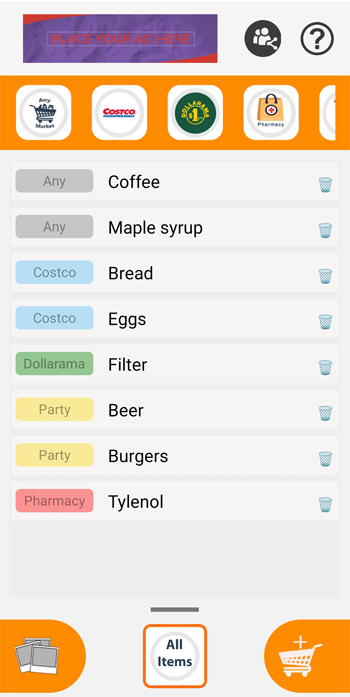

# Ed's ShopMemo

<h4>This application allows you to save the names of products that you need to remember to buy by dividing them by some locations.</h4>
</h4>It even lets you save photos or take them from your gallery to find out what the packaging of the product you want to remember really was.</h4>
</h4>And you can share any list or photo..</h4>

## Screenshots

 &emsp; &emsp; &emsp; &emsp; 
